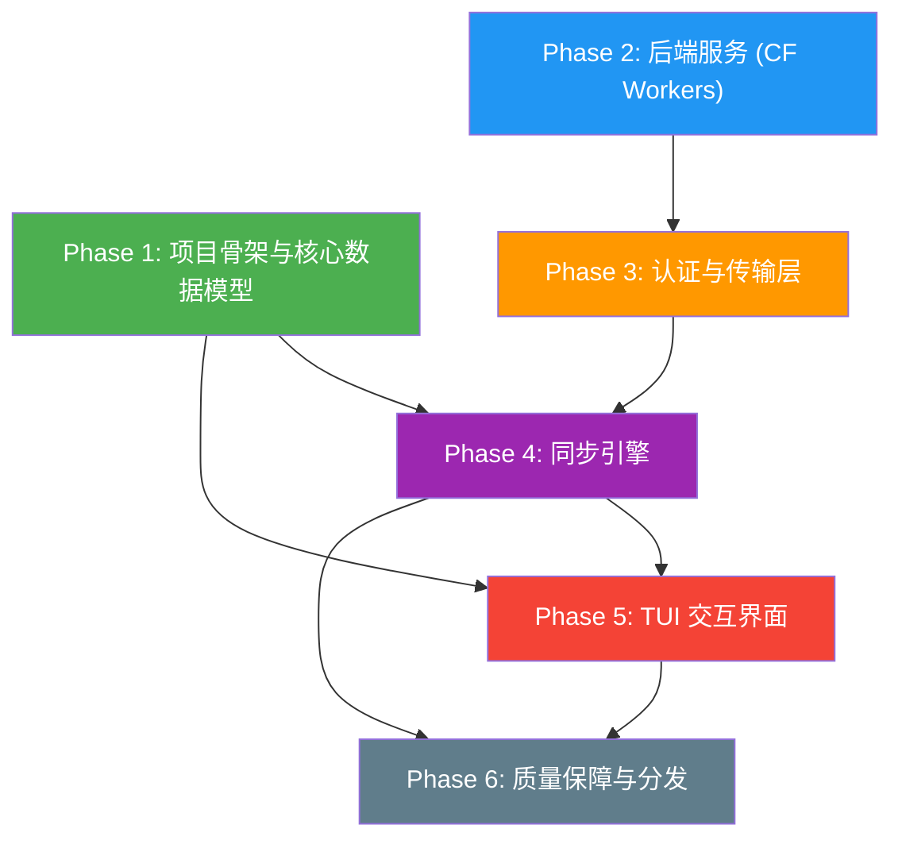
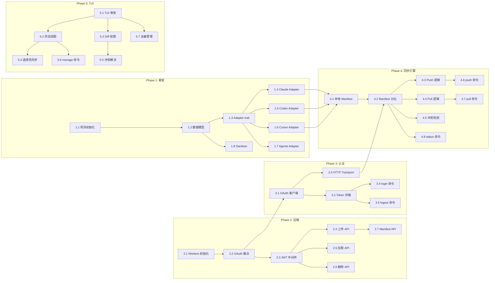

# Dependency Graph

## Phase 间依赖关系



## 关键路径

项目的关键路径为：

```
Phase 1 → Phase 4 → Phase 5 → Phase 6
```

Phase 2 和 Phase 3 可以与 Phase 1 **并行开发**，因为它们之间没有直接依赖。

## 任务级别依赖关系



## 并行开发机会

| 可并行组合 | 说明 |
|------------|------|
| Phase 1 + Phase 2 | Rust 端骨架与 CF Workers 后端可完全并行 |
| T1.4 + T1.5 + T1.6 + T1.7 | 四个 Adapter 相互独立 |
| T2.4 + T2.5 + T2.6 | 三个 CRUD 端点相互独立 |
| T4.3 + T4.4 + T4.5 | Push/Pull/冲突检测基于相同的 diff 结果，可并行 |
| T5.2 + T5.3 | 浏览视图和 Diff 视图可并行开发 |
